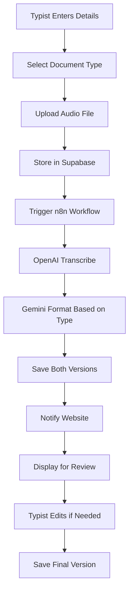

# Medical Transcription System Architecture

## 🎯 System Overview

A complete medical transcription system that:
1. Accepts audio with medical context (doctor, patient, document type)
2. Transcribes using OpenAI Whisper
3. Formats using Google Gemini 2.0 Flash based on document type
4. Returns formatted medical documents for review
5. Allows typists to verify against audio

## 📊 Complete Data Flow



## 🗄️ Database Schema Updates

### Enhanced `transcriptions` Table

```sql
-- Add new columns to existing table
ALTER TABLE transcriptions
ADD COLUMN IF NOT EXISTS formatted_text TEXT,
ADD COLUMN IF NOT EXISTS formatting_model VARCHAR(50) DEFAULT 'gemini-2.0-flash',
ADD COLUMN IF NOT EXISTS formatting_prompt TEXT,
ADD COLUMN IF NOT EXISTS is_formatted BOOLEAN DEFAULT false,
ADD COLUMN IF NOT EXISTS reviewed_at TIMESTAMP WITH TIME ZONE,
ADD COLUMN IF NOT EXISTS reviewed_by UUID REFERENCES auth.users(id),
ADD COLUMN IF NOT EXISTS final_text TEXT,
ADD COLUMN IF NOT EXISTS version INTEGER DEFAULT 1;

-- Create index for document types
CREATE INDEX IF NOT EXISTS idx_document_type ON transcriptions(document_type);
CREATE INDEX IF NOT EXISTS idx_is_formatted ON transcriptions(is_formatted);
```

### New `document_templates` Table

```sql
CREATE TABLE IF NOT EXISTS document_templates (
  id UUID DEFAULT gen_random_uuid() PRIMARY KEY,
  document_type VARCHAR(100) NOT NULL UNIQUE,
  display_name VARCHAR(200) NOT NULL,
  formatting_instructions TEXT NOT NULL,
  structure_template JSONB,
  example_output TEXT,
  is_active BOOLEAN DEFAULT true,
  created_at TIMESTAMP WITH TIME ZONE DEFAULT NOW(),
  updated_at TIMESTAMP WITH TIME ZONE DEFAULT NOW()
);

-- Insert default templates
INSERT INTO document_templates (document_type, display_name, formatting_instructions) VALUES
('consultation', 'Consultation Note', 'Format as a consultation note with chief complaint, history, examination, assessment, and plan sections.'),
('surgery_report', 'Surgery Report', 'Format as an operative report with preoperative diagnosis, postoperative diagnosis, procedure, findings, and technique sections.'),
('discharge_summary', 'Discharge Summary', 'Format with admission date, discharge date, diagnoses, hospital course, discharge medications, and follow-up sections.'),
('progress_note', 'Progress Note', 'Format as SOAP note: Subjective, Objective, Assessment, Plan.'),
('radiology_report', 'Radiology Report', 'Format with indication, technique, findings, and impression sections.'),
('pathology_report', 'Pathology Report', 'Format with gross description, microscopic description, and diagnosis sections.');
```

### New `transcription_edits` Table (Version History)

```sql
CREATE TABLE IF NOT EXISTS transcription_edits (
  id UUID DEFAULT gen_random_uuid() PRIMARY KEY,
  transcription_id UUID REFERENCES transcriptions(id) ON DELETE CASCADE,
  edited_text TEXT NOT NULL,
  edit_type VARCHAR(50), -- 'manual', 'ai_format', 'review'
  edited_by UUID REFERENCES auth.users(id),
  edit_reason TEXT,
  version INTEGER NOT NULL,
  created_at TIMESTAMP WITH TIME ZONE DEFAULT NOW()
);
```

## 🔧 n8n Workflow Components

### 1. Webhook Receiver
- Receives: audio, doctorName, patientName, documentType, userId

### 2. OpenAI Transcription Node
- Uses Whisper model
- Returns raw transcription with timestamps

### 3. Gemini Formatting Node (New)
- Uses Gemini 2.0 Flash
- Applies document-type-specific formatting
- Maintains medical terminology accuracy

### 4. Supabase Update
- Saves both raw and formatted versions
- Updates status flags

### 5. Website Notification
- Sends complete data back to Vercel app
- Includes both versions for review

## 🎨 Frontend Components

### 1. Upload Form Component
```typescript
interface TranscriptionUploadForm {
  doctorName: string;
  patientName: string;
  documentType: DocumentType;
  audioFile: File;
  urgency?: 'normal' | 'urgent';
  additionalNotes?: string;
}
```

### 2. Document Type Selector
- Dropdown with medical document types
- Shows description of each type
- Preview of expected format

### 3. Transcription Review Interface
```typescript
interface TranscriptionReview {
  audioPlayer: AudioPlayerComponent;
  rawTranscription: TextDisplay;
  formattedTranscription: EditableTextDisplay;
  sidePanel: {
    metadata: TranscriptionMetadata;
    actions: ReviewActions;
    history: VersionHistory;
  };
}
```

## 🚀 API Endpoints

### 1. `/api/transcribe-medical`
- Enhanced upload endpoint
- Validates document type
- Initiates n8n workflow

### 2. `/api/document-templates`
- GET: List available document types
- GET /:type: Get specific template details

### 3. `/api/transcription/:id/review`
- POST: Save reviewed/edited version
- GET: Get all versions

### 4. `/api/transcription/:id/export`
- Export as PDF, DOCX, or plain text

## 🔄 Vercel Deployment Configuration

### Environment Variables
```env
# Existing
NEXT_PUBLIC_SUPABASE_URL=
NEXT_PUBLIC_SUPABASE_ANON_KEY=
SUPABASE_SERVICE_ROLE_KEY=
N8N_WEBHOOK_URL=

# New for Gemini integration
GEMINI_API_KEY=
GEMINI_MODEL=gemini-2.0-flash
FORMATTING_TIMEOUT=30000

# Feature flags
ENABLE_AI_FORMATTING=true
ENABLE_VERSION_HISTORY=true
```

### Vercel Functions Configuration
```json
{
  "functions": {
    "api/transcribe-medical": {
      "maxDuration": 60
    },
    "api/transcription/[id]/review": {
      "maxDuration": 30
    }
  }
}
```

## 🎯 Key Features

### 1. Document Type Intelligence
- Pre-configured medical document formats
- Customizable per organization
- Template-based formatting

### 2. Quality Assurance
- Side-by-side comparison (audio vs text)
- Highlighted uncertain sections [?]
- Version control for edits

### 3. Efficiency Optimizations
- Parallel processing where possible
- Caching of templates
- Progressive loading of large transcriptions

### 4. Security & Compliance
- HIPAA-compliant data handling
- Audit trail for all edits
- Role-based access control

## 📈 Performance Targets

- **Upload to Transcription**: < 30 seconds
- **Transcription to Formatted**: < 10 seconds
- **Total End-to-End**: < 45 seconds
- **UI Update Latency**: < 500ms

## 🔍 Monitoring & Analytics

### Track:
- Document type usage
- Average processing time per type
- Edit frequency (manual corrections needed)
- User satisfaction metrics

### Alerts:
- Failed transcriptions
- Formatting errors
- Unusual processing times
- API rate limits

## 📝 User Workflow

1. **Typist Login** → Dashboard
2. **New Transcription** → Select type, enter details
3. **Upload Audio** → See progress indicator
4. **Wait for Processing** → ~45 seconds
5. **Review Interface** → Audio + Formatted text
6. **Make Edits** → Track changes visible
7. **Approve & Save** → Generate final document
8. **Export** → PDF/DOCX for records

## 🚧 Implementation Priority

### Phase 1: Core Functionality
- [x] Basic upload and transcription
- [ ] Gemini formatting integration
- [ ] Review interface

### Phase 2: Enhanced Features
- [ ] Version history
- [ ] Export capabilities
- [ ] Template customization

### Phase 3: Advanced
- [ ] Batch processing
- [ ] Auto-correction learning
- [ ] Multi-language support
