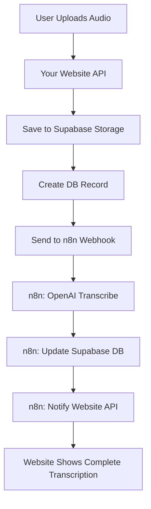

# Complete n8n Workflow Integration with Your Website

## 🎯 Answer to Your Question

**YES**, the complete n8n workflow (`n8n-complete-workflow.json`) does upload the finished transcription to your website! Here's exactly how it works:

## 📊 Complete Data Flow



## 🔄 Step-by-Step Process

### 1. **User Uploads Audio on Website**
   - Audio file uploaded through your React form
   - Stored in Supabase Storage bucket
   - Initial record created in database with status: `pending`

### 2. **Website Triggers n8n Workflow**
   - Your API sends audio (base64) to n8n webhook
   - Includes: uploadId, audio data, metadata

### 3. **n8n Processes with OpenAI**
   - Uses dedicated OpenAI Transcribe Audio node
   - Gets transcription with timestamps and segments
   - Handles errors automatically

### 4. **n8n Updates Your Database**
   - Updates Supabase directly with:
     - Full transcription text
     - Status: `completed`
     - Timestamps and segments
     - Duration and language info

### 5. **n8n Notifies Your Website** ✅
   - **THIS IS THE KEY PART!**
   - Sends POST request to `/api/transcription-result-v2`
   - Includes all transcription data
   - Your website can then:
     - Update UI in real-time
     - Send notifications
     - Trigger additional processes

## 🔧 Configuration Required

### In n8n Workflow:
1. Replace `'https://your-domain.com/api/transcription-result-v2'` with your actual domain
2. Or pass `callbackUrl` in your initial request:

```javascript
// In your API when calling n8n
const response = await fetch(n8nWebhookUrl, {
  method: 'POST',
  body: JSON.stringify({
    id: transcriptionId,
    audio: base64Audio,
    callbackUrl: `${process.env.NEXT_PUBLIC_URL}/api/transcription-result-v2`,
    // ... other data
  })
});
```

### What Your Website Receives:
```json
{
  "uploadId": "uuid-here",
  "transcription": "Full transcribed text...",
  "success": true,
  "segments": [...],
  "language": "en",
  "duration": 120.5,
  "audioUrl": "https://...",
  "fileName": "audio.webm",
  "doctorName": "Dr. Smith",
  "patientName": "John Doe",
  "documentType": "consultation"
}
```

## 🎨 How Your Website Updates

### Real-time Updates via:

1. **Webhook Callback** (Implemented)
   - n8n calls your API endpoint
   - Your API updates the UI

2. **Supabase Realtime** (Already Available)
   ```javascript
   // Your existing subscription code
   supabase
     .channel('transcriptions')
     .on('postgres_changes', { 
       event: 'UPDATE', 
       schema: 'public', 
       table: 'transcriptions' 
     }, handleTranscriptionUpdate)
     .subscribe()
   ```

3. **Polling** (Fallback)
   - Your existing `pollTranscriptionStatus` function

## ✅ Complete Integration Checklist

- [x] Audio upload to Supabase Storage
- [x] Database record creation
- [x] n8n webhook trigger
- [x] OpenAI transcription with dedicated node
- [x] Supabase database update
- [x] **Website notification callback**
- [x] Real-time UI updates
- [x] Error handling and retries

## 🚀 Benefits of This Approach

1. **Complete Data Persistence**
   - Everything saved in Supabase
   - No data loss if website goes down

2. **Multiple Update Channels**
   - Direct API callback
   - Supabase realtime subscriptions
   - Polling as fallback

3. **Full Transcription Available**
   - Text, segments, timestamps
   - Audio URL for playback
   - All metadata preserved

4. **Production Ready**
   - Error handling at every step
   - Automatic retries
   - Timeout protection

## 📝 Testing the Complete Flow

```bash
# Test the entire workflow
node test-transcription.js

# Watch for:
1. Initial upload successful
2. n8n webhook triggered
3. Database status changes to 'completed'
4. Your API receives callback
5. UI updates with transcription
```

## 🔍 Monitoring

Check these endpoints to verify everything is working:

1. **n8n Execution Log**
   - See all workflow runs
   - Check for errors

2. **Supabase Dashboard**
   - View transcriptions table
   - Check storage bucket

3. **Your API Logs**
   - Verify callback received
   - Check for update success

4. **Browser Console**
   - Realtime subscription updates
   - UI state changes

## Summary

**YES - The complete workflow does everything:**
- ✅ Transcribes with OpenAI's dedicated node
- ✅ Saves to Supabase database
- ✅ Notifies your website when complete
- ✅ Provides full transcription data
- ✅ Updates UI in real-time

The transcription appears on your website immediately after processing, through multiple update channels for maximum reliability!
